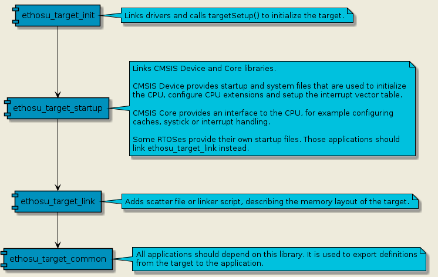
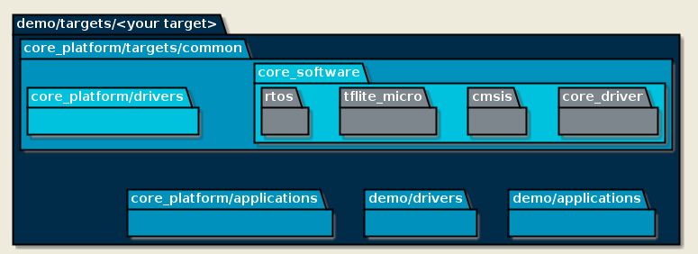

# Porting target

Core Platform provides examples how to build and run applications on a few
target platforms. This guide will demonstrate how to use CMake to extend the
Core Platform build system with applications, drivers and targets.

The build system is based on the idea that the *target* includes applications
and drivers. Applications should be platform agnostic without knowledge about
the target they are executing on, which in theory should allow applications to
be compiled for a range of targets. Consequently when generating the build
files, the path to the target is passed to CMake.

```
$ cmake -B build targets/<your target>
```

All targets should include [targets/common](targets/common/CMakeLists.txt). This
directory defines a hierarchy of interface libraries, which are needed by helper
functions and other CMake targets to configure the build system.



For a demo project that extends Core Platform, the subdirectories will be
included like the figure below illustrates.



A complete dependency tree can be generated with Graphviz.

```
$ cmake -B build --graphviz out.dot targets/<your target>
$ dot -T png -o out.png out.dot
```

# Create skeleton

Create a `demo` directory, or name the directory to whatever is preferred. This
will be the parent directory for the demo project.

```
$ mkdir demo
$ cd demo
```

Create subdirectories for `applications`, `drivers` and `targets`.

```
$ mkdir applications drivers targets
$ touch applications/CMakeLists.txt drivers/CMakeLists.txt
```

# demo/targets/\<your target\>/

Copy [\<core_platform\>/targets/demo](targets/demo) to `<your target>`.
directory. Rename the directory to whatever is preferred.

```
$ cp -r <core_platform>/targets/demo targets/
$ mv targets/demo targets/<your target>
```

## CMakeLists.txt

Open [targets/\<your target\>/CMakeLists.txt](targets/demo/CMakeLists.txt) and
customize the settings. The important sections have been marked with `TODO`.

### Default toolchain

Core Platform provides example toolchain files for Arm Clang and GCC. If a
custom toolchain is needed, then this can be placed under
`demo/cmake/toolchain/<name>.cmake` and the CMake variable
`CMAKE_TOOLCHAIN_FILE` set to point at this file.

### CTest

If there exists an emulator for the target platform - for example Arm Virtual
Hardware or QEmu - then `include(CTest)` can be uncommented and
`ETHOSU_COMMAND_DEFAULT` configured accordingly. Each of the application elf
files will be passed to the test command.

Generating the build system, building and testing can be executed like this.

```
$ cmake -B build targets/<your target>
$ cmake --build build
$ ctest --test-dir build
```

### Memory configuration

[README.md#Memory configurations](README.md#memory-configurations) describes the
memory configurations that can be considered when mapping the TFLM model, arena
and fast memory buffer. The scatter file and linker scripts decide where the
buffers are placed in memory, but can for flexibility be written to switch on
defines set by the build system.

The provided [CMakeLists.txt](targets/demo/CMakeLists.txt) demonstrates how the
CMake variables `FAST_MEMORY_SIZE`, `MEMORY_MODEL` and `MEMORY_ARENA` can be
used to export defines from the build system to the source files.

## target.cpp

`targetSetup()` is invoked from [targets/common/src/init.cpp](init.cpp), after
the runtime library has been initialized, before the `main()` function is
invoked. The purpose of this function is to initialize drivers, for example the
Ethos-U driver or the memory protection unit (MPU).

Open [targets/\<your target\>/target.cpp](targets/demo/target.cpp) in an editor
and customize the file.

## platform.scatter and platform.ld

Depending on the compiler either a scatter file (Arm Clang) or a linker script
(GCC) is used to describe the memory layout of the target. Documentation how to
write scatter files and linker scripts goes beyond the scope of this tutorial,
but can be found online. The scatter files and linker scripts provided for
Corstone-300 and Corstone-310 may also be used as reference.

A design decision that needs to be made is if a boot loader or scatter loading
shall be used. A boot loader copies one or multiple binaries into memory before
lifting the reset on the Cortex-M CPU. Scatter loading typically means that a
single firmware binary has been written in flash. The Cortex-M CPU boots from
flash and copies memory segments from the firmware binary to for example ITCM,
DTCM and SRAM.

# demo/applications/

Copy the [hello world](applications/hello_world) application to `applications/`.
This application can be used as template to start with.

```
$ cp -r <core_platform>/applications/hello_world applications/
$ mv applications/hello_world applications/demo_app
```

Open `applications/demo_app/CMakeLists.txt` and rename the application from
`hello_world` to `demo_app`.

```
ethosu_add_executable_test(demo_app PRIVATE
    SOURCES main.cpp)
```

Edit `applications/CMakeLists.txt` and add the `demo_app` subdirectory.

```
add_subdirectory(demo_app)
```

# demo/drivers/

Create a directory structure for a demo driver. Good practice is to separate
header files with public APIs in a separate folder.

```
$ mkdir drivers/demo
$ cd drivers/demo

$ mkdir include src
$ touch CMakeList.txt include/demo.hpp src/demo.cpp
```

Add the demo subdirectory to `drivers/CMakeLists.txt`.

```
add_subdirectory(demo)
```

Edit `drivers/demo/CMakeLists.txt` and define a static library.

```
add_library(demo STATIC)
target_include_directories(demo PUBLIC include)
target_sources(demo PRIVATE src/demo.cpp)
```

Edit `drivers/demo/include/demo.hpp` and place types and prototypes here.

```
void demo();
```

Edit `drivers/demo/src/demo.cpp`. `printf()` is used for its smaller memory
footprint, but `iostream` would also work.

```
#include <stdio.h>

void demo() {
    printf("Hello Demo\n");
}
```

Edit `targets/<your target>/CMakeLists.txt` and link the `demo` library.

```
target_link_libraries(ethosu_target_startup INTERFACE
    demo)
```

Edit `targets/<your target>/target.cpp` and call `demo()` from `targetSetup()`.
