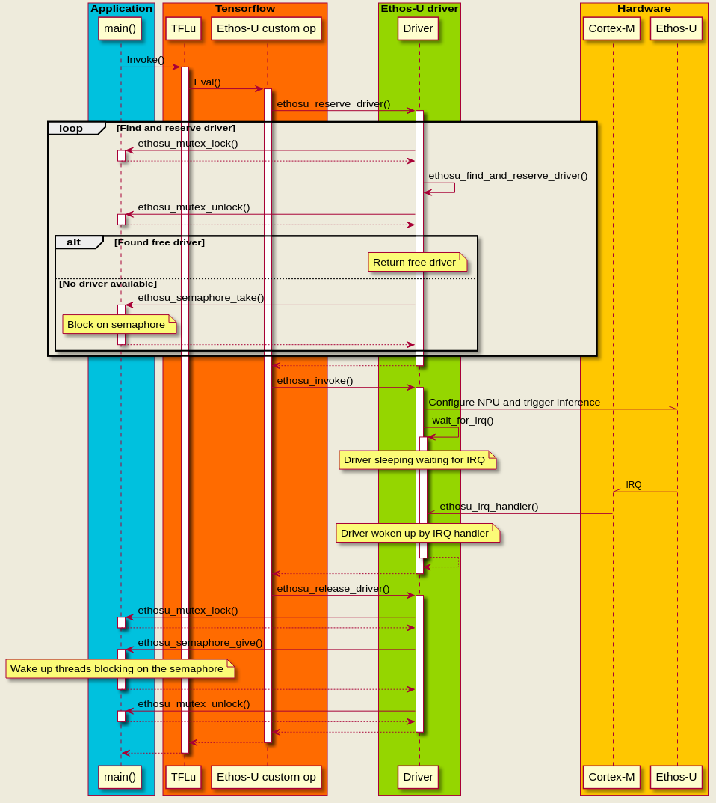
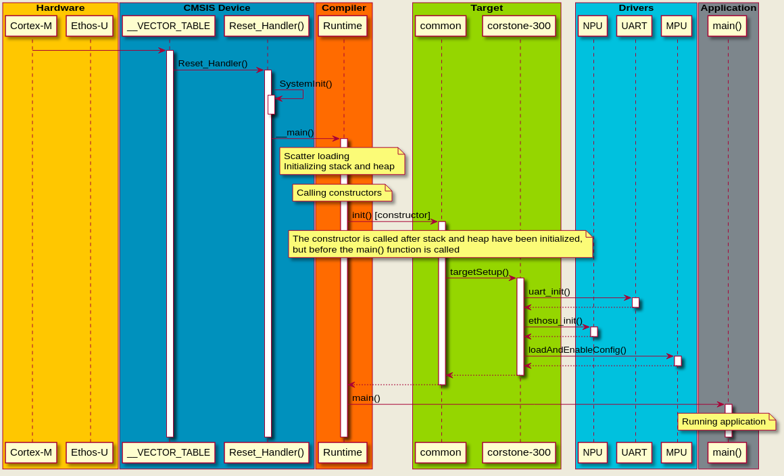

# Arm(R) Ethos(TM)-U core platform

Arm(R) Ethos(TM)-U core platform is provided as an example of how to produce a
firmware binary for a given target platform. This software is primarily intended
for guidance, to demonstrate how to boot up a firmware binary and how to run an
inference on an Arm Ethos-U compatible platform.

This repository contains target specific files, like linker scripts. Target
agnostic software components are provided in the
[core_software](https://git.mlplatform.org/ml/ethos-u/ethos-u-core-software.git)
repository.

# Arm(R) Corstone(TM)-300

The
[Arm(R) Corstone(TM)-300](https://developer.arm.com/ip-products/subsystem/corstone/corstone-300)
is a reference design of how to to build a secure System on Chip (SoC). A fixed
virtual platform (FVP) of the Arm Corstone-300 including the Arm Ethos-U can be
downloaded from the Ecosystem page at
[developer.arm.com](https://developer.arm.com/tools-and-software/open-source-software/arm-platforms-software/arm-ecosystem-fvps).
Once installed, make sure to add the path of the FVP executables to your PATH
environment variable.

## Building

Building core platform requires a recent version of CMake, a C/C++ cross compiler
for Arm Cortex-M and Python 3.7+. There are sample toolchain files provided for
Arm Clang and Arm GCC.

To run the helper scripts Python 3.7+ is required, together with the packages listed in
`requirements.txt`.

```
$ pip install -U pip
$ pip install -r requirements.txt
```

The following commands will compile the platform and produce application elf
files that can be run on the FVP. If no NPU configuration is specified, the default
configuration `ethos-u55-128` will be used.

```
$ cmake -B build targets/corstone-300
$ cmake --build build
```

To specify NPU and configuration, set the `ETHOSU_TARGET_NPU_CONFIG` variable.
Please note that applications compiled for Ethos-U55 will not run on Ethos-U65 FVP
and vice versa.

```
$ cmake -B build targets/corstone-300 -DETHOSU_TARGET_NPU_CONFIG=ethos-u65-256
$ cmake --build build
```

It is also possible to build with a different toolchain.

```
$ cmake -B build targets/corstone-300 --toolchain $PWD/cmake/toolchain/arm-none-eabi-gcc.cmake
$ cmake --build build
```

## Building on Windows

Building on a Windows host requires no special tools or shells, and can for
example be done from a CMD prompt, Git Bash or from the CMake GUI. Only
requirement is the build tools have been added to the path variable.

CMake supports a long list of generators, for example Ninja, NMake or Makefiles.
For Windows Ninja has been verified to work well, but any of the supported
generators should be possible to use.

Please note that the maximum path length is by default set to 260 characters on
Windows. It is recommended to place the Ethos-U source tree and build folder at
the root of the file system.

```
CMD> cmake -G Ninja -B build targets/corstone-300 --toolchain %CD%\cmake\toolchain\arm-none-eabi-gcc.cmake
CMD> cmake --build build
```

## run_platform.py

The purpose of the `scripts/run_platform.py` script is to deploy a network model
on an FVP target (Corstone-300 by default). It takes a TensorFlow Lite model
(.tflite file) as input, compiles it through Vela, optimizes the model, builds
the baremetal application for the target and finally runs an inference on the
FVP. The output is compared with reference data generated by Python TFLite. Note
that if not provided, the input data to the network is randomly generated. To
provide the script with a custom set of input and output data, use the
`--custom-input` and `--custom-output` arguments respectively (See command
below):

```
$ scripts/run_platform.py --custom-input <path to input data file> --custom-output <path to output data file> --network-path <.tflite network>
```

### Memory placement of data
Both model and arena can be placed in SRAM or DRAM. Note that the choice of a
memory placement will affect the performance, and that large network models
might not fit in SRAM. Use `--memory_model` and `--memory_arena` arguments
respecitvely for configuring the model and arena memory placement, as in the
example below:

```
$ scripts/run_platform.py --memory_model {sram,dram} --memory_arena {sram,dram} --network-path <.tflite network>
```

If not specified, by default the model is placed in DRAM and the arena in SRAM.

### PMU event counters
The maximum number of performance counters depends on the hardware. For
Ethos-U55 and Ethos-U65 this is 4 PMU counters. A full list of the PMU events
can be found in
[ethosu55_interface.h](https://git.mlplatform.org/ml/ethos-u/ethos-u-core-driver.git/tree/src/ethosu55_interface.h)
or
[ethosu65_interface.h](https://git.mlplatform.org/ml/ethos-u/ethos-u-core-driver.git/tree/src/ethosu65_interface.h)
header files. To enable PMU counters the `--pmu` argument can be used as
exemplified below:

```
$ scripts/run_platform.py --pmu <event #0> --pmu <event #1> --pmu <event #2> --pmu <event #3> --network-path <.tflite network>
```

### Timing adapters
The timing adapters are used to introduce latency to AXI transactions. This is
useful to emulate memory characteristics of different memory technologies, for
example when conducting performance measurements. For Corstone-300 there are two
timing adapters. They are placed at the NPU's AXI interfaces. The script also
offers configuration of the timing adapters by setting parameters such as number
of pending transactions, read and write latencies, number of cycles of let
through or blocked addresses, etc. Please refer to the help message for a more
extensive list of arguments that can be passed to the script.

## Corstone-300 FVP

Assuming that the Corstone-300 FVP has been downloaded, installed and placed in
the PATH variable. Then the software binaries can be tested like this.

```
$ ctest
```

Individual applications can also be run directly with the FVP, for example like
this

```
$ FVP_Corstone_SSE-300_Ethos-U55 applications/freertos/freertos.elf
```
or like this for Ethos-U65 FVP.

```
$ FVP_Corstone_SSE-300_Ethos-U65 applications/freertos/freertos.elf
```

The Corstone-300 FVP(s) allows some parameters to be modified, for example the
number of Ethos-U MAC units can be configured with
`-C ethosu.num_macs=<64|128|256|...>`. Please note that the network must be
recompiled with Vela if the MAC configuration changes. Please also note that the
set of valid MAC configuration is different for Ethos-U55 and Ethos-U65.

Ethos-U55 FVP.

```
$ FVP_Corstone_SSE-300_Ethos-U55 -C ethosu.num_macs=256 applications/freertos/freertos.elf
```
Same as above but for Ethos-U65 FVP.

```
$ FVP_Corstone_SSE-300_Ethos-U65 -C ethosu.num_macs=512 applications/freertos/freertos.elf
```

## Corstone-310 FVP

Applications for the Corstone-310 FVP are built and tested similarly to the
Corstone-300.

```
$ cmake -B build targets/corstone-310
$ cmake --build build
```

Assuming the `FVP_Corstone_SSE-310` executable can be found via the PATH
variable, the unit tests can be executed with `ctest`.

```
$ ctest --test-dir build
```

## Corstone-300 MPS3 FPGA

The files needed to get started for Corstone-300 can be found on
[developer.arm.com](https://developer.arm.com/tools-and-software/development-boards/fpga-prototyping-boards/download-fpga-images).

Follow the documentation in the downloaded archive to setup the board with the
Corstone-300 FPGA bit files.

The built files can then be ran by adapting the steps in chapter *Software*,
using the extracted binary files from the build process. This is needed for the
boot loader on the FPGA to be able to load the memories.

1. Copy the binary files for the application in the `fw` folder to the board
   `<MPS3_dir>/SOFTWARE` folder, making sure the filename is max 8 characters
   long.
2. Navigate to <MPS3_dir>MB/HBI0309C/<version> and open the images.txt file in a
   text editor.
3. Remove the lines under the '[IMAGES]' section and replace it with:

```
TOTALIMAGES: 2

IMAGE0ADDRESS: 0x01000000
IMAGE0UPDATE:  AUTO
IMAGE0FILE:    \SOFTWARE\10000000 ; ITCM secure

IMAGE1ADDRESS: 0x0c000000
IMAGE1UPDATE:  AUTO
IMAGE1FILE:    \SOFTWARE\70000000 ; DDR secure
```

The mapping between the Cortex-M55 address space and the addresses the FPGA MMC
boot loader need can be found in section *MCC Memory mapping* of the
documentation in the Corstone-300 FPGA archive. A part of the table is shown
below.

| Cortex-M55  | MMC Bootloader | Name            |
|-------------|----------------|-----------------|
| 0x0000_0000 | 0x0000_0000    | ITCM non secure |
| 0x1000_0000 | 0x0100_0000    | ITCM secure     |
| 0x0100_0000 | 0x0200_0000    | SRAM non secure |
| 0x1100_0000 | 0x0300_0000    | SRAM secure     |
| 0x6000_0000 | 0x0800_0000    | DDR non secure  |
| 0x7000_0000 | 0x0c00_0000    | DDR secure      |

For example, the binary that the Cortex-M55 CPU expects at address 0x1000_0000
must therefor be written by the MCC to 0x0100_0000.

Power up the board with the PBON and the application output will be seen on the
serial console.

# Memory configurations

Embedded systems come in very different configurations, but typically they have
a limited amount of high bandwidth low latency memory like SRAM, and some more
low bandwidth high latency memory like flash or DRAM.

The Tensorflow Lite for Microcontrollers (TFLM) framework needs two buffers to
run an inference, the *model* and the *arena*. The model contains static data
like weights and biases. The arena contains read write data like activations,
IFM, OFM, temporary data etc. Please note that the IFM and OFM are located
*inside* of the arena.

The placement of the model and arena has a big impact on the performance. There
are three configurations that make sense for most systems.

| Model      | Arena      | Spilling | Note           |
|------------|------------|----------|----------------|
| SRAM       | SRAM       | No       |                |
| Flash/DRAM | SRAM       | No       |                |
| Flash/DRAM | Flash/DRAM | Yes      | Ethos-U65 only |

Spilling is only available for Ethos-U65 and means that the TFLM model and arena
are placed in slower memory like flash or DRAM, with a smaller *fast memory*
buffer placed in faster memory like SRAM.

## Model and arena in SRAM

For optimal performance both model and arena should be placed in SRAM.

## Model in flash/DRAM, arena in SRAM

If both model and arena do not fit in SRAM, then it makes most sense to move the
model to flash/DRAM. The performance penalty depends on the network and will
need to be measured. For example weight bound networks will experience a larger
performance drop than MAC bound networks.

## Model and arena in flash/DRAM (Ethos-U65 only)

Moving both model and arena to flash/DRAM comes with quite a hefty performance
penalty. To mitigate some of this *spilling* can be used.

Spilling means that a small buffer is reserved in SRAM that acts like a cache
for frequently accessed data. When spilling is enabled
[Vela](https://git.mlplatform.org/ml/ethos-u/ethos-u-vela.git/about/) will add
extra instructions to the command stream to DMA copy data between the arena and
the spilling buffer.

Some of the data stored in the spilling buffer must be copied back to the arena,
which is done as DMA transfer over AXI interface 1. This is only supported by
Ethos-U65, because Ethos-U55 is equipped with a readonly AXI 1 interface.

## NPU region configuration

To achieve good performance it is important not to mix slow and fast memory
transactions on the same AXI interface. The default setup is to map the arena to
AXI interface 0 and the model to AXI interface 1.

However, if spilling is used the arena should be moved to AXI interface 1 and
the spilling buffer routed over interface 0. This will ensure that slow memory
transactions are routed over AXI interface 1 and fast memory transactions over
AXI interface 0.

The routing of the arena is controlled by define `NPU_REGIONCFG_1`. This define
is declared in
[ethosu_config_u55.h](https://git.mlplatform.org/ml/ethos-u/ethos-u-core-driver.git/tree/src/ethosu_config_u55.h)
or
[ethosu_config_u65.h](https://git.mlplatform.org/ml/ethos-u/ethos-u-core-driver.git/tree/src/ethosu_config_u65.h)
depending on which NPU architecture the driver is built for. The default
configuration is protected by `#ifdef` that can be overridden by the build
system. Values `0` and `1` map to AXI interface 0 and `2` and `3` map to AXI
interface 1.

The routing of the model is controlled by `NPU_REGIONCFG_0` and the spilling
buffer by `NPU_REGIONCFG_2`. For most use cases these configurations should not
need to be changed.

## NPU burst length

The NPU issues DMA bursts over the AXI interfaces. The burst length is defined
by the `AXI_LIMIT<nr>_MAX_BEATS_BYTES` in
[ethosu_config_u55.h](https://git.mlplatform.org/ml/ethos-u/ethos-u-core-driver.git/tree/src/ethosu_config_u55.h)
or
[ethosu_config_u65.h](https://git.mlplatform.org/ml/ethos-u/ethos-u-core-driver.git/tree/src/ethosu_config_u65.h)
and is by default set to its minimum value.

Longer burst lengths will in general yield higher performance. However, burst
lengths that exceed the maximum supported burst length risk hanging the AXI bus,
so it is important to configure this value correctly.

# Porting target

Please see [PORTING.md](PORTING.md).

# Multi NPU

The Tensorflow Lite for Microcontrollers (TFLM) framework supports running
multiple parallel inferences. Each parallel inference requires a TFLM arena
(costs memory) and a stack (requires an RTOS). The examples provided in this
repo are implemented in the application layer, which means that any RTOS could
be used.

The Ethos-U NPU driver is implemented in plain C. To enable thread safety in a
multi-threading environment the driver defines a set of weak functions that the
application is expected to override, providing implementations for mutex and
semaphore primitives.

The weak function can be found in
[ethosu_driver.c](https://git.mlplatform.org/ml/ethos-u/ethos-u-core-driver.git/tree/src/ethosu_driver.c?id=35b5d0eebf9709a3439d362a0b53d6270cbc4a94#n173).
An example based on FreeRTOS how to override and implement these functions can
be found in
[applications/freertos/main.cpp](https://git.mlplatform.org/ml/ethos-u/ethos-u-core-platform.git/tree/applications/freertos/main.cpp?id=991af2bd8fb6c79dfb317837353857f34a727b17#n108).

The sequence diagram below illustrates the call stack for a multi NPU system.
Please note how the `ethosu_mutex_*` and `ethosu_semaphore_*` functions are
implemented in the application layer. Mutexes are used for thread safety and
semaphores for sleeping.



## Multi NPU tradeoffs

A single Cortex-M is capable of driving multiple Ethos-U. What the optimal
number of Ethos-U is, that is impossible to tell without knowing which network
to run or without detailed knowledge about the limitations of the embedded
system.

Each parallel inference requires an arena. The arena should for optimal
performance be placed in a high bandwidth low latency memory like SRAM, which is
a cost that has to be considered. The size of the arena varies greatly depending
on the network.

For networks that map fully to Ethos-U, the memory bandwidth might become a
limiting factor. For networks that run partly in software, the Cortex-M might
become the limiting factor. The placement of the TFLM model and arena (flash,
DRAM, SRAM, etc) will also have a big impact on the performance.

# Startup

The applications in this repo use
[CMSIS Device](https://github.com/ARM-software/CMSIS_5/tree/develop/Device/) to
startup the Cortex-M. The standard procedure is to copy and modify the CMSIS
templates, but in this repo we have chosen to include the unmodified templates
directly from CMSIS.

The sequence diagram below describes what happens after the Cortex-M reset is
lifted, up until the execution enters the application `main()`.



## CMSIS Device

First thing that happens is that the CPU loads index 0 from the interrupt vector
into the SP register and index 1 into the PC register, and then starts executing
from the PC location.

Index 1 in the VTOR is referred to as the reset handler and is resposible for
initializing the CPU. If the CPU for example has a FPU or MVE extension, then
these are enabled.

## Compiler runtime

The entry function for the compiler runtime setup varies depending on which
compiler that is used. For Arm Clang this function is called `__main()`, not to
be confused with the application `main()`!

The runtime is responsible for initializing the memory segments and setting up
the runtime environment. Please refer to the compiler documentation for detailed
information about the runtime setup.

## Target

The [`init()`](targets/common/src/init.cpp) is defined as a constructor, which
will be called before the application `main()`. We use this constructor to run
`targetSetup()` to initialize the platform.

For each target there is a `targets/<target>` directory, which contains linker
scripts and code needed to setup the target. `targetSetup()` is implemented in
this folder and is responsible for initializing drivers, configuring the MPU,
enabling caches etc.

Adding a new target would involve creating a new `targets/<target>` directory,
providing linker scripts and implementing `targetSetup()`.

## Application

Finally the runtime calls application `main()`. Ideally the application code
should be generic and have no knowledge about which target it is executing on.

# License

The Arm Ethos-U core platform is provided under an Apache-2.0 license. Please
see [LICENSE.txt](LICENSE.txt) for more information.

# Contributions

The Arm Ethos-U project welcomes contributions under the Apache-2.0 license.

Before we can accept your contribution, you need to certify its origin and give
us your permission. For this process we use the Developer Certificate of Origin
(DCO) V1.1 (https://developercertificate.org).

To indicate that you agree to the terms of the DCO, you "sign off" your
contribution by adding a line with your name and e-mail address to every git
commit message. You must use your real name, no pseudonyms or anonymous
contributions are accepted. If there are more than one contributor, everyone
adds their name and e-mail to the commit message.

```
Author: John Doe \<john.doe@example.org\>
Date:   Mon Feb 29 12:12:12 2016 +0000

Title of the commit

Short description of the change.

Signed-off-by: John Doe john.doe@example.org
Signed-off-by: Foo Bar foo.bar@example.org
```

The contributions will be code reviewed by Arm before they can be accepted into
the repository.

In order to submit a contribution push your patch to
`ssh://<GITHUB_USER_ID>@review.mlplatform.org:29418/ml/ethos-u/ethos-u-core-platform`.
To do this you will need to sign-in to
[review.mlplatform.org](https://review.mlplatform.org) using a GitHub account
and add your SSH key under your settings. If there is a problem adding the SSH
key make sure there is a valid email address in the Email Addresses field.

# Security

Please see [Security](SECURITY.md).

# Trademark notice

Arm, Cortex, Corstone and Ethos are registered trademarks of Arm Limited (or its
subsidiaries) in the US and/or elsewhere.
