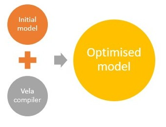
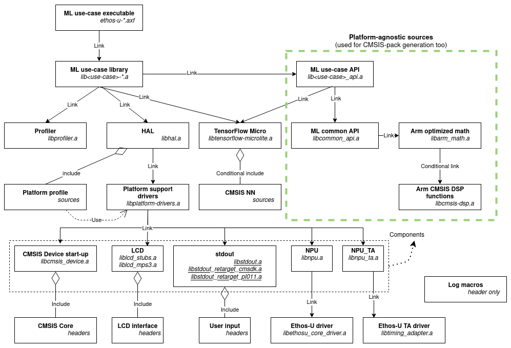

# Arm® ML embedded evaluation kit

- [Arm® ML embedded evaluation kit](./documentation.md#arm_ml-embedded-evaluation-kit)
  - [Trademarks](./documentation.md#trademarks)
  - [Prerequisites](./documentation.md#prerequisites)
    - [Additional reading](./documentation.md#additional-reading)
  - [Repository structure](./documentation.md#repository-structure)
  - [Models and resources](./documentation.md#models-and-resources)
  - [Building](./documentation.md#building)
  - [Deployment](./documentation.md#deployment)
  - [Implementing custom ML application](./documentation.md#implementing-custom-ml-application)
  - [Testing and benchmarking](./documentation.md#testing-and-benchmarking)
  - [Memory Considerations](./documentation.md#memory-considerations)
  - [Troubleshooting](./documentation.md#troubleshooting)
  - [Appendix](./documentation.md#appendix)
  - [FAQ](./documentation.md#faq)

## Trademarks

- Arm® and Cortex® are registered trademarks of Arm® Limited (or its subsidiaries) in the US and/or elsewhere.
- Arm® and Ethos™ are registered trademarks or trademarks of Arm® Limited (or its subsidiaries) in the US and/or
  elsewhere.
- Arm® and Corstone™ are registered trademarks or trademarks of Arm® Limited (or its subsidiaries) in the US and/or
  elsewhere.
- Arm®, Keil® and µVision® are registered trademarks of Arm Limited (or its subsidiaries) in the US and/or elsewhere.
- TensorFlow™, the TensorFlow logo, and any related marks are trademarks of Google Inc.

## Prerequisites

Before starting the setup process, please make sure that you have:

- A Linux x86_64 based machine. If using Microsoft® Windows®, Windows Subsystem for Linux (WSL) is preferable.
  > **Note:** Currently, Microsoft® Windows® is not supported as a build environment.

- At least one of the following toolchains:
  - GNU Arm Embedded toolchain (version 10.2.1 or above) -
  [GNU Arm Embedded toolchain downloads](https://developer.arm.com/tools-and-software/open-source-software/developer-tools/gnu-toolchain/gnu-rm/downloads)
  - Arm Compiler (version 6.16 or above) with a valid license -
  [Arm Compiler download Page](https://developer.arm.com/tools-and-software/embedded/arm-compiler/downloads)

- An Arm® MPS3 FPGA prototyping board and components for FPGA evaluation or a `Fixed Virtual Platform` binary:
  - An MPS3 board loaded with Arm® Corstone™-300 (`AN552`) or Corstone™-310 reference package (`AN555`). See
    <https://developer.arm.com/downloads/-/download-fpga-images>. You
    must have a USB connection between your machine and the MPS3 board - for UART menu and for deploying the
    application.
  - `Arm® Corstone™-300` based FVP for MPS3 is available from:
    <https://developer.arm.com/tools-and-software/open-source-software/arm-platforms-software/arm-ecosystem-fvps>.
  - `Arm® Corstone™-310` based FVP is available under Arm® Virtual Hardware: <https://www.arm.com/products/development-tools/simulation/virtual-hardware>

> **Note:**: There are two Arm® Corstone™-300 implementations available for the MPS3 FPGA board - application
> notes `AN547` and `AN552`. We are aligned with the latest application note `AN552`. However, the application built
> for MPS3 target should work on both FPGA packages.

### Additional reading

This document contains information that is specific to Arm® Ethos™-U55 and Arm® Ethos™-U65 products. Please refer to the following documents
for additional information:

- ML platform overview: <https://mlplatform.org/>

- Arm® ML processors technical overview: <https://developer.arm.com/ip-products/processors/machine-learning>

- Arm® `Cortex-M55`® processor: <https://www.arm.com/products/silicon-ip-cpu/cortex-m/cortex-m55>

- Arm® `Cortex-M85`® processor: <https://www.arm.com/products/silicon-ip-cpu/cortex-m/cortex-m85>

- ML processor, also referred to as a Neural Processing Unit (NPU) - Arm® `Ethos™-U55`:
    <https://www.arm.com/products/silicon-ip-cpu/ethos/ethos-u55>

- ML processor, also referred to as a Neural Processing Unit (NPU) - Arm® `Ethos™-U65`:
    <https://www.arm.com/products/silicon-ip-cpu/ethos/ethos-u65>

- Arm® MPS3 FPGA Prototyping Board:
    <https://developer.arm.com/tools-and-software/development-boards/fpga-prototyping-boards/mps3>

- Arm® Fixed Virtual Platforms: <https://developer.arm.com/Tools%20and%20Software/Fixed%20Virtual%20Platforms>

- Arm® Virtual Hardware: <https://www.arm.com/products/development-tools/simulation/virtual-hardware>

- Arm® ML-Zoo: <https://github.com/ARM-software/ML-zoo/>

- Arm® Ethos-U NPU™ software: <https://review.mlplatform.org/plugins/gitiles/ml/ethos-u/ethos-u>

To access Arm documentation online, please visit: <http://developer.arm.com>

## Repository structure

The repository has the following structure:

```tree
├── CMakeLists.txt
├── dependencies
├── docs
├── model_conditioning_examples
├── resources
├── /resources_downloaded/
├── scripts
│     ├── cmake
│     │    ├── platforms
│     │    │      ├── mps3
│     │    │      ├── native
│     │    │      └── simple_platform
│     │    └── ...
│     └── ...
├── source
│     ├── application
│     │    ├── api
│     │    │    ├── common
│     │    │    └── use_case
│     │    └── main
│     ├── hal
│     │    ├── include
│     │    └── source
│     ├── log
│     │    └── include
│     ├── math
│     │    └── include
│     ├── profiler
│     │    └── include
│     use_case
│       └── <usecase_name>
│           ├── include
│           ├── src
│           └── usecase.cmake
└── tests
```

What these folders contain:

- `dependencies`: All the third-party dependencies for this project. These are either populated by `git submodule` or by
    downloading packages in the required hierarchy. See `download_dependencies.py`.

- `docs`: Detailed documentation for this repository.

- `model_conditioning_examples`: short example scripts that demonstrate some methods available in TensorFlow
    to condition your model in preparation for deployment on Arm Ethos NPU.

- `resources`: contains ML use-cases applications resources such as input data, label files, etc.

- `resources_downloaded`: created by `set_up_default_resources.py`, contains downloaded resources for ML use-cases
    applications such as models, test data, etc. It also contains a Python virtual environment with all the required
    packages installed.

- `scripts`: Build and source generation scripts.

- `scripts/cmake/platforms`: Platform build configuration scripts `build_configuration.cmake` are located here.
   These scripts are adding platform sources into the application build stream. The script has 2 functions:
  - `set_platform_global_defaults` - to set platform source locations and other build options.
  - `platform_custom_post_build` - to execute specific post build steps. For example, MPS3 board related script adds
                                    board specific `images.txt` file creation and calls bin generation command.
                                    Native profile related script compiles unit-tests.

- `source`: C/C++ sources for the platform and ML applications.

  The contents of the *application* sub-folder is as follows:

  - `application`: All sources that form the *core* of the application. The `use-case` part of the sources depend on the
    sources themselves, such as:
    - `main`: Contains the main function and calls to platform initialization logic to set up things before launching
      the main loop. Also contains sources common to all use-case implementations.

    - `api`: Contains **platform-agnostic** API that all the use case examples can use. It depends only on TensorFlow
      Lite Micro and math functionality exposed by `math` module. It is further subdivided into:

      - `common`: Common part of the API. This consists of the generic code like neural network model initialisation,
        running an inference, and some common logic used for image and audio use cases.

      - `use_case`: This contains "model" and "processing" APIs for each individual use case. For example, KWS use case
        contains a class for a generic KWS neural network model and the "processing" API give user an easier way to drive
        the MFCC calculations.

> **NOTE:** The API here is also used to export a CMSIS-pack from this repository and therefore, it is imperative to
> that the sources here do not depend on any HAL component or drive any platform dependent logic. If you are looking to
> reuse components from this repository for your application level logic, this directory should be the prime candidate.

  - `hal`: Contains Hardware Abstraction Layer (HAL) sources, providing a platform-agnostic API to access hardware
    platform-specific functions.

> **Note:** Common code related to the `Arm Ethos-U NPU` software framework resides in *hal/components* sub-folder.

  - `log`: Common to all code logging macros managing log levels.

  - `math`: Math functions to be used in ML pipelines. Some of them use CMSIS DSP for optimized execution on Arm CPUs.
     It is a separate CMake project that is built into a static library `libarm_math.a`.

  - `profiler`: profiling utilities code to collect and output cycle counts and PMU information.
    It is a separate CMake project that is built into a static library `libprofiler.a`.

  - `use_case`: Contains the ML use-case specific logic. Stored as a separate subfolder, it helps isolate the
    ML-specific application logic. With the assumption that the `application` performs the required setup for logic to
    run. It also makes it easier to add a new use-case block.

  - `tests`: Contains the x86 tests for the use-case applications.

The HAL has the following structure:

```tree
hal
├── CMakeLists.txt
├── include
│     ├── hal.h
│     ├── hal_lcd.h
│     └── hal_pmu.h
└── source
    ├── components
    │     ├── cmsis_device
    │     ├── lcd
    │     ├── npu
    │     ├── npu_ta
    │     ├── platform_pmu
    │     └── stdout
    ├── hal.c
    ├── hal_pmu.c
    └── platform
        ├── mps3
        ├── native
        └── simple
```

HAL is built as a separate project into a static library `libhal.a`. It is linked with use-case executable.

What these folders contain:

- The folders `include` and `source/hal.c` contain the HAL top-level platform API and data acquisition, data presentation, and
  timer interfaces.
    > **Note:** the files here and lower in the hierarchy have been written in C and this layer is a clean C/ + boundary
    > in the sources.

- `source/components` directory contains API and implementations for different modules that can be reused for different
  platforms. These contain common functions for Arm Ethos-U NPU initialization, timing adapter block helpers and others.
  Each component produces a static library that could potentially be linked into the platform library to enable
  usage of corresponding modules from the platform sources. For example, most of the use-cases use NPU and
  timing adapter initialization. Similarly, the LCD component provides a standard LCD API used by HAL and propagated
  up the hierarchy. Two static library targets are provided for the LCD module - one with stubbed implementation and the
  other which can drive the LCD on an Arm MPS3 target. If you want to run default ML use-cases on a custom platform, you
  could re-use existing code from this directory provided it is compatible with your platform.

- `source/components/cmsis_device` has a common startup code for Cortex-M based systems. The package defines interrupt vector table and
    handlers. Reset handler - starting point of our application - is also defined here. This entry point is responsible
    for the set-up before calling the user defined "main" function in the higher-level `application` logic.
    It is a separate CMake project that is built into a static library `libcmsis_device.a`. It depends on a CMSIS repo
    through `CMSIS_SRC_PATH` variable.
    The static library is used by platform code.

- `source/platform/mps3`\
  `source/platform/simple`:
  These folders contain platform specific declaration and defines, such as, platform initialisation code, peripheral
  memory map, system registers, system specific timer implementation and other.
  Platform is built from selected components and configured cmsis device. It is a separate CMake project, and is
  built into a static library `libplatform-drivers.a`. It is linked into HAL library.

## Models and resources

The models used in the use-cases implemented in this project can be downloaded from:

- [Arm ML-Zoo](https://github.com/ARM-software/ML-zoo) ( [Apache 2.0 License](https://github.com/ARM-software/ML-zoo/blob/master/LICENSE) )

  - [Mobilenet V2](https://github.com/ARM-software/ML-zoo/tree/e0aa361b03c738047b9147d1a50e3f2dcb13dbcb/models/image_classification/mobilenet_v2_1.0_224/tflite_int8)
  - [MicroNet for Keyword Spotting](https://github.com/ARM-software/ML-zoo/tree/9f506fe52b39df545f0e6c5ff9223f671bc5ae00/models/keyword_spotting/micronet_medium/tflite_int8)
  - [Wav2Letter](https://github.com/ARM-software/ML-zoo/tree/1a92aa08c0de49a7304e0a7f3f59df6f4fd33ac8/models/speech_recognition/wav2letter/tflite_pruned_int8)
  - [MicroNet for Anomaly Detection](https://github.com/ARM-software/ML-zoo/tree/7c32b097f7d94aae2cd0b98a8ed5a3ba81e66b18/models/anomaly_detection/micronet_medium/tflite_int8)
  - [MicroNet for Visual Wake Word](https://github.com/ARM-software/ML-zoo/raw/7dd3b16bb84007daf88be8648983c07f3eb21140/models/visual_wake_words/micronet_vww4/tflite_int8/vww4_128_128_INT8.tflite)
  - [RNNoise](https://github.com/ARM-software/ML-zoo/raw/a061600058097a2785d6f1f7785e5a2d2a142955/models/noise_suppression/RNNoise/tflite_int8/rnnoise_INT8.tflite)

- [Emza Visual Sense ModelZoo](https://github.com/emza-vs/ModelZoo) ( [Apache 2.0 License](https://github.com/emza-vs/ModelZoo/blob/v1.0/LICENSE) )

  - [YOLO Fastest](https://github.com/emza-vs/ModelZoo/blob/v1.0/object_detection/yolo-fastest_192_face_v4.tflite)

When using *Ethos-U* NPU backend, Vela compiler optimizes the the NN model. However, if not and it is supported by
TensorFlow Lite Micro, then it falls back on the CPU and execute.



The Vela compiler is a tool that can optimize a neural network model into a version that run on an embedded system
containing the *Ethos-U* NPU.

The optimized model contains custom operators for sub-graphs of the model that the *Ethos-U* NPU can accelerate. The
remaining layers that cannot be accelerated, are left unchanged, and are run on the CPU using optimized, `CMSIS-NN`, or
reference kernels provided by the inference engine.

For detailed information, see: [Optimize model with Vela compiler](./sections/building.md#Optimize-custom-model-with-Vela-compiler).

## Building

This section explains the build process and intra-project dependencies, describes how to build the code sample
applications from sources and includes illustrating the build options and the process.

The following graph of source modules aims to explain better intra-project code and build execution dependencies.


The project can be built for MPS3 FPGA and FVP emulating MPS3. Using default values for configuration parameters builds
executable models that support the *Ethos-U* NPU.

For further information, please see:

- [Building the ML embedded code sample applications from sources](./sections/building.md#building-the-ml-embedded-code-sample-applications-from-sources)
  - [Build prerequisites](./sections/building.md#build-prerequisites)
  - [Build options](./sections/building.md#build-options)
  - [Build process](./sections/building.md#build-process)
    - [Preparing build environment](./sections/building.md#preparing-build-environment)
      - [Fetching submodules](./sections/building.md#fetching-submodules)
      - [Fetching resource files](./sections/building.md#fetching-resource-files)
    - [Create a build directory](./sections/building.md#create-a-build-directory)
    - [Configuring the build for MPS3 SSE-300](./sections/building.md#configuring-the-build-for-mps3-sse_300)
      - [Using GNU Arm embedded toolchain](./sections/building.md#using-gnu-arm-embedded-toolchain)
      - [Using Arm Compiler](./sections/building.md#using-arm-compiler)
      - [Generating project for Arm Development Studio](./sections/building.md#generating-project-for-arm-development-studio)
      - [Configuring with custom TPIP dependencies](./sections/building.md#configuring-with-custom-tpip-dependencies)
    - [Configuring native unit-test build](./sections/building.md#configuring-native-unit_test-build)
    - [Configuring the build for simple-platform](./sections/building.md#configuring-the-build-for-simple_platform)
    - [Building the configured project](./sections/building.md#building-the-configured-project)
  - [Building timing adapter with custom options](./sections/building.md#building-timing-adapter-with-custom-options)
  - [Add custom inputs](./sections/building.md#add-custom-inputs)
  - [Add custom model](./sections/building.md#add-custom-model)
  - [Optimize custom model with Vela compiler](./sections/building.md#optimize-custom-model-with-vela-compiler)
  - [Building for different Ethos-U NPU variants](./sections/building.md#building-for-different-ethos_u-npu-variants)
  - [Automatic file generation](./sections/building.md#automatic-file-generation)

## Deployment

This section describes how to deploy the code sample applications on the Fixed Virtual Platform (FVP) or the MPS3 board.

For further information, please see:

- [Deployment](./sections/deployment.md#deployment)
  - [Fixed Virtual Platform](./sections/deployment.md#fixed-virtual-platform)
    - [Setting up the MPS3 Corstone-300 FVP](./sections/deployment.md#setting-up-the-mps3-arm-corstone_300-fvp)
    - [Deploying on an FVP emulating MPS3](./sections/deployment.md#deploying-on-an-fvp-emulating-mps3)
  - [MPS3 board](./sections/deployment.md#mps3-board)
    - [Deployment on MPS3 board](./sections/deployment.md#deployment-on-mps3-board)

## Implementing custom ML application

This section describes how to implement a custom Machine Learning application running on a platform supported by the
repository, either an FVP or an MPS3 board.

Both the *Cortex-M55* CPU and *Ethos-U* NPU Code Samples software project offers a way to incorporate extra use-case
code into the existing infrastructure. It also provides a build system that automatically picks up added functionality
and produces corresponding executable for each use-case.

For further information, please see:

- [Implementing custom ML application](./sections/customizing.md#implementing-custom-ml-application)
  - [Software project description](./sections/customizing.md#software-project-description)
  - [Hardware Abstraction Layer API](./sections/customizing.md#hardware-abstraction-layer-api)
  - [Main loop function](./sections/customizing.md#main-loop-function)
  - [Application context](./sections/customizing.md#application-context)
  - [Profiler](./sections/customizing.md#profiler)
  - [NN Model API](./sections/customizing.md#nn-model-api)
  - [Adding custom ML use-case](./sections/customizing.md#adding-custom-ml-use_case)
  - [Implementing main loop](./sections/customizing.md#implementing-main-loop)
  - [Implementing custom NN model](./sections/customizing.md#implementing-custom-nn-model)
  - [Executing inference](./sections/customizing.md#executing-inference)
  - [Printing to console](./sections/customizing.md#printing-to-console)
  - [Reading user input from console](./sections/customizing.md#reading-user-input-from-console)
  - [Output to MPS3 LCD](./sections/customizing.md#output-to-mps3-lcd)
  - [Building custom use-case](./sections/customizing.md#building-custom-use_case)
  - [Adding custom platform support](./sections/customizing.md#adding-custom-platform-support)

## Testing and benchmarking

Please refer to: [Testing and benchmarking](./sections/testing_benchmarking.md#testing-and-benchmarking).

## Memory Considerations

Please refer to:

- [Memory considerations](./sections/memory_considerations.md#memory-considerations)
  - [Understanding memory usage from Vela output](./sections/memory_considerations.md#understanding-memory-usage-from-vela-output)
    - [Total SRAM used](./sections/memory_considerations.md#total-sram-used)
    - [Total Off-chip Flash used](./sections/memory_considerations.md#total-off_chip-flash-used)
  - [Memory mode configurations](./sections/memory_considerations.md#memory-mode-configurations)
  - [Tensor arena and neural network model memory placement](./sections/memory_considerations.md#tensor-arena-and-neural-network-model-memory-placement)
  - [Memory usage for ML use-cases](./sections/memory_considerations.md#memory-usage-for-ml-use_cases)
  - [Memory constraints](./sections/memory_considerations.md#memory-constraints)

## Troubleshooting

For further information, please see:

- [Troubleshooting](./sections/troubleshooting.md#troubleshooting)
  - [Inference results are incorrect for my custom files](./sections/troubleshooting.md#inference-results-are-incorrect-for-my-custom-files)
  - [The application does not work with my custom model](./sections/troubleshooting.md#the-application-does-not-work-with-my-custom-model)
  - [NPU configuration mismatch error when running inference](./sections/troubleshooting.md#npu-configuration-mismatch-error-when-running-inference)
  - [Errors when cloning the repository](./sections/troubleshooting.md#errors-when-cloning-the-repository)
  - [Problem installing Vela](./sections/troubleshooting.md#problem-installing-vela)
  - [No matching distribution found for ethos-u-vela==3.3.0](./sections/troubleshooting.md#no-matching-distribution-found-for-ethos_u_vela)
    - [How to update Python3 package to newer version](./sections/troubleshooting.md#how-to-update-python3-package-to-newer-version)

## Appendix

Please refer to:

- [Appendix](./sections/appendix.md#appendix)
  - [Cortex-M55 Memory map overview](./sections/appendix.md#arm_cortex_m55-memory-map-overview-for-corstone_300-reference-design)

## FAQ

Please refer to: [FAQ](./sections/faq.md#faq)
