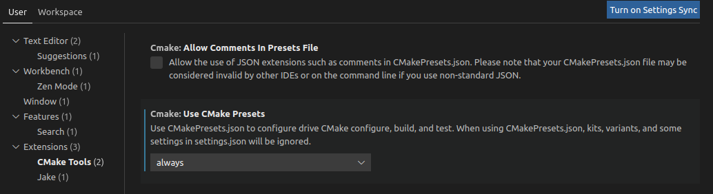

# Building with CMake Presets

If you are using CMake version 3.23.3 or above, then an alternative method of building is by using CMake Presets.

## Using presets with Visual Studio Code (VS Code)

CMake Presets are well supported by most IDEs and serve as a developer-convenience tool. This section would demonstrate the use of CMake Presets in VS Code.
In order to use CMake Presets in VS Code the [CMake Tools extension](https://code.visualstudio.com/docs/cpp/cmake-linux) has to be installed and *Use Cmake Presets* option has to be turned to either *always* or *auto*.

For further information on how to enable the use of CMake and presets in VS Code please refer to [VS Code CMake Tools documentation](https://github.com/microsoft/VSCode-cmake-tools/blob/main/docs/cmake-presets.md).

Once the presets are enabled in VS Code and the root folder of the project is opened in the editor - VS Code should automatically find the `CMakePresets.json` (or `CMakeUserPresets.json`) in the root folder and parse them accordingly.
From that point user can switch between configurations and build the selected preset using the toolbar at the bottom of the editor:

The project provides basing configuration and build presets along with one CTest test preset (for native platform only). Each configuration preset has only one build preset. All build presets have different use-cases listed as targets for user convenience.

It is encouraged to create a personal `CMakeUserPreset.json` with personal user presets that are based on the provided default presets. User's preset file automatically includes the default preset file. An example of such a user preset can be find below:
```
{
    "version": 4,
    "cmakeMinimumRequired": {
        "major": 3,
        "minor": 23,
        "patch": 0
    },
    "configurePresets": [
        {
            "name": "example-user-preset",
            "displayName": "My config simple-gcc",
            "description": "This preset uses public presets available in this repository.",
            "inherits": [
                "simple-gcc",
                "log-debug",
                "single-input"
            ]
        }
    ],
    "buildPresets": [
        {
            "name": "build-kws",
            "displayName": "kws",
            "configurePreset": "example-user-preset",
            "jobs": 8,
            "targets": [
                "ethos-u-kws"
            ]
        },
        {
            "name": "build-object_detection",
            "displayName": "object detection",
            "configurePreset": "example-user-preset",
            "jobs": 8,
            "targets": [
                "ethos-u-object_detection"
            ]
        }
    ]
}
```
VS Code will include all configurations from both `CMakePresets.json` and `CMakeUserPresets.json` in the drop-down menus in the toolbar.
Using the *build* option from the VS Code toolbar would both configure the project and build project using the generator that can be set in settings. By default Cmake tools use Ninja generator.

## Using presets from the command line

Presets can be also used from a command-line:
```commandline
cmake --preset <config-name>
cmake --build --preset <config-name>
```
where config-name is one of:
```commandline
native
mps3-300-gcc
mps3-300-clang
mps3-310-gcc
mps3-310-clang
simple-gcc
simple-clang
```
This will automatically configure and build the evaluation-kit into a corresponding folder.
You can still pass in build flags as usual, for example:
```commandline
cmake --preset mps3-300-gcc -DUSE_CASE_BUILD=inference_runner
cmake --build --preset mps3-300-gcc
```