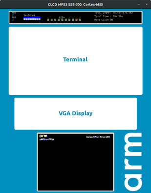
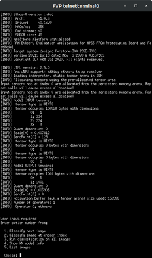
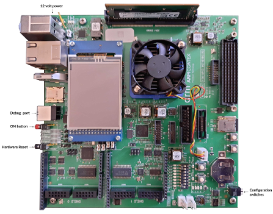

# Deployment

- [Deployment](./deployment.md#deployment)
  - [Fixed Virtual Platform](./deployment.md#fixed-virtual-platform)
    - [Setting up the MPS3 Arm Corstone-300 FVP](./deployment.md#setting-up-the-mps3-arm-corstone_300-fvp)
    - [Deploying on an FVP emulating MPS3](./deployment.md#deploying-on-an-fvp-emulating-mps3)
    - [Running the FVP without the UI](./deployment.md#running-the-fvp-without-the-ui)
  - [MPS3 board](./deployment.md#mps3-board)
    - [MPS3 board top-view](./deployment.md#mps3-board-top_view)
    - [Deployment on MPS3 board](./deployment.md#deployment-on-mps3-board)

The sample application for Arm® Ethos™-U55 can be deployed on two target platforms:

- A physical Arm MPS3 FPGA prototyping board
- An MPS3 FVP

Both implement the Arm® Corstone™-300 design. For further information, please refer to:
[Arm Corstone-300](https://www.arm.com/products/iot/soc/corstone-300)

## Fixed Virtual Platform

The FVP is available publicly from the following page:
[Arm Ecosystem FVP downloads](https://developer.arm.com/tools-and-software/open-source-software/arm-platforms-software/arm-ecosystem-fvps).

Please ensure that you download the correct archive from the list under Arm® Corstone™-300. You need the one which:

- Emulates MPS3 board and *not* for MPS2 FPGA board,
- Contains support for Arm® Ethos™-U55 and Ethos™-U65 processors.

### Setting up the MPS3 Arm Corstone-300 FVP

To install the FVP:

- Unpack the archive.

- Run the installation script in the extracted package:

    `./FVP_Corstone_SSE-300.sh`

- Follow the instructions to install the FVP to your required location.

### Deploying on an FVP emulating MPS3

This section assumes that the FVP has been installed (see
[Setting up the MPS3 Arm Corstone-300 FVP](./deployment.md#setting-up-the-mps3-arm-corstone-300-fvp))
to the home directory of the user: `~/FVP_Corstone_SSE-300`. The installation, typically, has the
executable under `~/FVP_Corstone_SSE-300/model/<OS>_<compiler-version>/` directory. For the example
below, we assume it is: `~/FVP_Corstone_SSE-300/models/Linux64_GCC-6.4`.

For Arm Virtual Hardware, the installation paths are different (see Arm Virtual Hardware's
[Useful Links](./arm_virtual_hardware.md#useful-links) section).

> **NOTE**: The commandline arguments for the FVP mentioned below are valid for FVPs (and AVH) for
> both Arm® Corstone™-300 and Corstone™-310.

To run a use-case on the FVP, from the [Build directory](../sections/building.md#create-a-build-directory):

```commandline
~/FVP_Corstone_SSE-300/models/Linux64_GCC-6.4/FVP_Corstone_SSE-300_Ethos-U55 -a ./bin/ethos-u-<use_case>.axf
telnetterminal0: Listening for serial connection on port 5000
telnetterminal1: Listening for serial connection on port 5001
telnetterminal2: Listening for serial connection on port 5002
telnetterminal5: Listening for serial connection on port 5003

    Ethos-U rev 0 --- Oct 13 2020 11:27:45
    (C) COPYRIGHT 2019-2020 Arm Limited
    ALL RIGHTS RESERVED
```

This also launches a telnet window with the standard output from the sample application. And also error log entries
containing information about the pre-built application version, TensorFlow Lite Micro library version used, and data
type. It also includes the input and output tensor sizes of the model that are compiled into the executable binary.

> **Note:** For details on the specific use-case, follow the instructions in the corresponding documentation.

After starting, the application outputs a menu and waits for the user-input from the telnet terminal.

For example, the image classification use-case on *Ethos-U55* processor can be started by using:

```commandline
~/FVP_Corstone_SSE-300/models/Linux64_GCC-6.4/FVP_Corstone_SSE-300_Ethos-U55 -a ./bin/ethos-u-img_class.axf
```

Meanwhile, for *Ethos-U65*:

```commandline
~/FVP_Corstone_SSE-300/models/Linux64_GCC-6.4/FVP_Corstone_SSE-300_Ethos-U65 -a ./bin/ethos-u-img_class.axf
```





The FVP supports many command-line parameters, such as:

- Those passed by using `-C <param>=<value>`. The most important ones are:
  - `ethosu.num_macs`: Sets the *Ethos-U* configuration for the model. The valid parameters are:
    - *Ethos-U55*: `32`, `64`, `256`, and the default one `128`.
    - *Ethos-U65*: `256`, and the default one `512`.

    The number signifies the 8x8 MACs that are performed per cycle-count and that are available on
    the hardware.
  - `cpu0.CFGITCMSZ`: The ITCM size for the *Cortex-M* CPU. The size of ITCM is *pow(2, CFGITCMSZ - 1)* KB
  - `cpu0.CFGDTCMSZ`: The DTCM size for the *Cortex-M* CPU. The size of DTCM is *pow(2, CFGDTCMSZ - 1)* KB
  - `mps3_board.telnetterminal0.start_telnet`: Starts the telnet session if nothing connected.
  - `mps3_board.uart0.out_file`: Sets the output file to hold the data written by the UART. Use `'-'` to send all output
    to `stdout` and is empty by default).
  - `mps3_board.uart0.shutdown_on_eot`: Shut down the simulation when an `EOT (ASCII 4)` char is transmitted.
  - `mps3_board.visualisation.disable-visualisation`: Enables, or disables, visualization and is disabled by default.

  To start the model in `128` mode for *Ethos-U55*:

    ```commandline
    ~/FVP_Corstone_SSE-300/models/Linux64_GCC-6.4/FVP_Corstone_SSE-300_Ethos-U55 -a ./bin/ethos-u-img_class.axf -C ethosu.num_macs=128
    ```

  To start the model in `512` mode for *Ethos-U65*:

    ```commandline
    ~/FVP_Corstone_SSE-300/models/Linux64_GCC-6.4/FVP_Corstone_SSE-300_Ethos-U65 -a ./bin/ethos-u-img_class.axf -C ethosu.num_macs=512
    ```

- `-l`: shows the full list of supported parameters

    ```commandline
    ~/FVP_Corstone_SSE-300/models/Linux64_GCC-6.4/FVP_Corstone_SSE-300_Ethos-U55 -l
    ```

- `--stat`: prints some run statistics on simulation exit

    ```commandline
    ~/FVP_Corstone_SSE-300/models/Linux64_GCC-6.4/FVP_Corstone_SSE-300_Ethos-U55 --stat
    ```

- `--timelimit`: sets the number of wall clock seconds for the simulator to run, excluding startup and shutdown.

### Running the FVP without the UI

If there is a need to run the FVP without the UI (e.g running the FVP inside of a docker container),
it can be done as follows:

Add `-C mps3_board.visualisation.disable-visualisation=1` and `-C mps3_board.telnetterminal0.start_telnet=0`
to the command line arguments when starting the FVP. For example:

```commandline
FVP_install_location/models/Linux64_GCC-6.4/FVP_Corstone_SSE-300_Ethos-U55 \
    -C mps3_board.visualisation.disable-visualisation=1 \
    -C mps3_board.telnetterminal0.start_telnet=0 \
    ./bin/mps3-sse-300/ethos-u-<use_case>.axf
   ```

Once the FVP reports waiting on telnet connections, connect to the first serverport from another terminal.
Assuming the FVP has the telnet server running at the default port 5000, connect to it by:

```commandline
telnet localhost 5000
```

## MPS3 board

> **Note:**  Before proceeding, make sure that you have the MPS3 board powered on, and a USB A to B cable connected
> between your machine and the MPS3. The connector on the MPS3 is marked as "Debug USB".



### MPS3 board top-view

Once the board has booted, the micro SD card is enumerated as a mass storage device. On most systems, this is
automatically mounted. However, manual mounting is sometimes required.

Also, check for four serial-over-USB ports that are available for use through this connection. On Linux-based machines,
these would typically be */dev/ttyUSB\<n\>* to */dev/ttyUSB\<n+3\>*.

The default configuration for all of them is `115200`, `8/N/1`. So, 15200 Baud, 8 bits, no parity, and one stop bit,
with no flow control.

> **Note:** For Windows machines, extra FTDI drivers may be required for these serial ports to be available.

For more information on getting started with an MPS3 board, please refer to:
[MPS3 Getting Started](https://developer.arm.com/-/media/Arm%20Developer%20Community/PDF/MPS3GettingStarted.pdf).

### Deployment on MPS3 board

To run the application on MPS3 platform, you must first ensure that the platform has been set up using the correct
configuration.

> **Note:**: These instructions are valid only if the evaluation is being done using the MPS3 FPGA platform using
> an Arm® Corstone™-300 (AN552) or Corstone™-310 (AN555) implementations.

For details on platform set-up, please see the relevant documentation.

- Arm® Corstone™-300 implementation `AN552`: [Arm Developer - AN552](https://developer.arm.com/documentation/dai0552/).
- Arm® Corstone™-310 implementation `AN555`: [Arm Developer - AN555](https://developer.arm.com/documentation/107642/B/?lang=en)

For the MPS3 FPGA board, instead of loading the `axf` file directly, copy the executable blobs generated under the
`sectors/<use_case>` subdirectory to the micro SD card located on the board. Also, the `sectors/images.txt` file is
used by the MPS3 to understand which memory regions the blobs must be loaded into.

Once the USB A to USB B cable between the MPS3 and the development machine is connected, and the MPS3 board powered on,
the board enumerates as a mass storage device over this USB connection.

Depending on the version of the board you are using, there might be two devices listed. The device named `V2M-MPS3`, or
`V2MMPS3` is the `SD card`. Note that if `V2M-MPS3` or `V2MMPS3` device is not listed, you may need to enable USB
connection from the board. You can do this by opening a serial connection to the first serial port (as specified in
point 3 in the instructions below) and issuing a `usb_on` command at the prompt:

```commandline
Cmd> usb_on
Enabling debug USB...
USB Serial Number = 5000123456789
```

If the `axf` or `elf` file is within the ITCM/BRAM load size limit, it can be copied into the FPGA memory directly
without having to break it down into separate load region-specific blobs. However, if the neural network models exceed
this size, you must use the approach described below.

1. For example, the image classification use-case produces the following for Corstone™-300:

    ```tree
    ./bin/sectors/
        └── img_class
            ├── ddr.bin
            └── itcm.bin
    ```
    For Corstone™-310, the tree should have:
    ```tree
    ./bin/sectors/
        └── img_class
            ├── ddr.bin
            └── bram.bin
    ```
    As reflected in the names above, the primary code memory for Arm® Corstone™-300 is the ITCM. For Arm® Corstone™-310
    however, this is the FPGA SRAM (or BRAM) region instead. This is because the ITCM is only 32kB which cannot
    accommodate the code footprint for our applications.

    Assuming that the micro SD card is mounted at `/media/user/V2M-MPS3/`, we can use:
    ```commandline
    cp -av ./bin/sectors/img_class/* /media/user/V2M-MPS3/SOFTWARE/ && sync
    ```

    Note that the `itcm.bin` (or `bram.bin`) and `ddr.bin` files correspond to the part of the application residing in
    the first and second load region respectively, as defined in the
    [scatter file for sse-300](../../scripts/cmake/platforms/mps3/sse-300/mps3-sse-300.sct)
    and [scatter file for sse-310](../../scripts/cmake/platforms/mps3/sse-310/mps3-sse-310.sct)


2. The `./bin/sectors/images.txt` file must be copied over to the MPS3. The exact location for the destination depends
   on the version of the MPS3 board and the application note for the bit file in use.

   For example, with revision `C` of the MPS3 board hardware, using an application note directory named `AN552`, we can
   replace the `images.txt` file by:

    ```commandline
    cp ./bin/sectors/images.txt /media/user/V2M-MPS3/MB/HBI0309C/AN552/images.txt && sync
    ```

> **NOTE**: Make sure the SD card is unmounted correctly after all the files have been copied. For example:
> ```commandline
> umount /media/user/V2M-MPS3
> ```

3. Open the first serial port available from MPS3. For example, `/dev/ttyUSB0`. This can be typically done using
   `minicom`, `screen`, or `Putty` applications. Make sure the configuration is set to 115200 8/N/1 and that the
   flow control setting is switched off:

    ```commandline
    minicom --D /dev/ttyUSB0
    ```

    ```log
    Welcome to minicom 2.7.1
    OPTIONS: I18n
    Compiled on Aug 13 2017, 15:25:34.
    Port /dev/ttyUSB0, 16:05:34
    Press CTRL-A Z for help on special keys
    Cmd>
    ```

4. In another terminal, open the second serial port. For example: `/dev/ttyUSB1`:

    ```commandline
    minicom --D /dev/ttyUSB1
    ```

5. On the first serial port, issue a "reboot" command and then press the return key:

    ```commandline
    $ Cmd> reboot
    ```

    ```log
    Rebooting...
    Disabling debug USB..
    Board rebooting...

    ARM V2M-MPS3 Firmware v1.5.1
    Build Date: Jun  2 2021

    Powering up system...
    Switching on main power...
    Configuring motherboard (rev C, var A)...
    ```

    This goes on to reboot the board and prime the application to run by flashing the binaries into their respective
    FPGA memory locations. For example:

    ```log
    Reading images file \MB\HBI0309C\AN552\images.txt
    Writing File \SOFTWARE\itcm.bin to Address 0x00000000
    ......
    File \SOFTWARE\itcm.bin written to memory address 0x00000000
    Image loaded from \SOFTWARE\itcm.bin
    Writing File \SOFTWARE\ddr.bin to Address 0x0C000000
    .......................................................................................................................................................................
    File \SOFTWARE\ddr.bin written to memory address 0x0C000000
    Image loaded from \SOFTWARE\ddr.bin
    ```

6. If the reboot from previous step completes without starting the application, issue a reset command:

    ``` commandline
    $ Cmd> reset
    ```

    This should trigger the application to start, and the output should be visible on the second serial
    connection. By default, the FPGA configuration should start the application as soon as it is loaded
    into the memory and the above command should not be required.

7. On the second serial port the output should show the standard output and error streams from the
   application deployed. For example:

    ```log
    INFO - V2M-MPS3 revision C
    INFO - Application Note AN552, Revision B
    INFO - MPS3 build 2
    INFO - MPS3 core clock has been set to: 32000000Hz
    INFO - CPU ID: 0x411fd220
    INFO - CPU: Cortex-M55 r1p0
    ...
    ```

The next section of the documentation details: [Implementing custom ML application](customizing.md).
