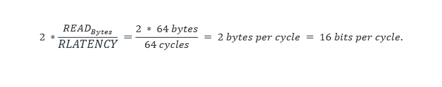
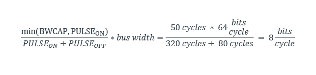

# Timing adapter

The sources contain the configuration for a `Timing Adapter (TA)` utility for the *Arm® Ethos™-U* NPU driver. The
timing adapter allows the platform to simulate user provided memory bandwidth and latency constraints on platforms that
support it. It aims to control the behavior of two AXI buses used by *Ethos-U* NPU - one is for SRAM memory region, and
the other is for flash or DRAM.

The SRAM is where intermediate buffers are expected to be allocated and therefore, this region can serve frequent read
and write traffic generated by computation operations while executing a neural network inference. The flash or DDR is
where we expect to store the model weights and therefore, this bus would only usually be used for RO traffic.

It is used for MPS3 FPGA and for Fast Model environment (or [AVH](./arm_virtual_hardware.md#overview)).

> **NOTE**: All Arm® Corstone™-300 based platform implementations fully support the use of `timing adapter` to perform
> bandwidth/latency sweeps for performance estimation of the Arm® Ethos™-U NPUs. However, Arm® Corstone™-310's
> implementation of timing adapter is, different and, unsuitable for such benchmarking. See
> [differences between timing adapter implementations](#differences-between-timing-adapter-implementations-in-arm-corstone_300-and-arm-corstone_310) for more details. Therefore, for Arm® Corstone™-310 targets, the
> CMake configuration is set up to ignore the timing adapters, if any, entirely. If you want to do any NPU performance
> benchmarking for different bandwidth and latency conditions, we recommend using the Arm® Corstone™-300
> implementations.

## Building timing adapter with custom options

The CMake build framework allows the parameters to control the behavior of each bus with following parameters:

- `MAXR`: Maximum number of pending read operations allowed. `0` is inferred as infinite and the default value is `4`.

- `MAXW`: Maximum number of pending write operations allowed. `0` is inferred as infinite and the default value is `4`.

- `MAXRW`: Maximum number of pending read and write operations allowed. `0` is inferred as infinite and the default
  value is `8`.

- `RLATENCY`: Minimum latency, in cycle counts, for a read operation. This is the duration between `ARVALID` and
  `RVALID` signals. The default value is `50`.

- `WLATENCY`: Minimum latency, in cycle counts, for a write operation. This is the duration between `WVALID` and
  `WLAST`, with `BVALID` being deasserted. The default value is `50`.

- `PULSE_ON`: The number of cycles where addresses are let through. The default value is `5100`.

- `PULSE_OFF`: The number of cycles where addresses are blocked. The default value is `5100`.

- `BWCAP`: Maximum number of 64-bit words transferred per pulse cycle. A pulse cycle is defined by `PULSE_ON`
  and `PULSE_OFF`. `0` is inferred as infinite and the default value is `625`.

  > **Note:** The bandwidth cap `BWCAP` operates on the transaction level and, because of its simple implementation,
  > the accuracy is limited.
  > When set to a small value it allows only a small number of transactions for each pulse cycle.
  > Once the counter has reached or exceeded the configured cap, no transactions will be allowed before the next pulse
  > cycle. In order to minimize this effect some possible solutions are:
  >
  > - scale up all the parameters to a reasonably large value.
  > - scale up `BWCAP` as a multiple of the burst length (in this case bulk traffic will not face rounding errors in
  >   the bandwidth cap).

- `MODE`: Timing adapter operation mode. Default value is `0`.

  - `Bit 0`: `0`=simple, `1`=latency-deadline QoS throttling of read versus write,

  - `Bit 1`: `1`=enable random AR reordering (`0`=default),

  - `Bit 2`: `1`=enable random R reordering (`0`=default),

  - `Bit 3`: `1`=enable random B reordering (`0`=default)

For the CMake build configuration of the timing adapter, the SRAM AXI is assigned `index 0` and the flash, or DRAM, AXI
bus has `index 1`.

To change the bus parameter for the build a "***TA_\<index>_*"** prefix should be added to the above. For example,
**TA0_MAXR=10** sets the maximum pending reads to 10 on the SRAM AXI bus.

As an example, if we have the following parameters for the flash, or DRAM, region:

- `TA1_MAXR` = "2"

- `TA1_MAXW` = "0"

- `TA1_MAXRW` = "0"

- `TA1_RLATENCY` = "64"

- `TA1_WLATENCY` = "32"

- `TA1_PULSE_ON` = "320"

- `TA1_PULSE_OFF` = "80"

- `TA1_BWCAP` = "50"

For a clock rate of 500MHz, this would translate to:

- The maximum duty cycle for any operation is:\
  

- Maximum bit rate for this bus (64-bit wide) is:\
  

- With a read latency of 64 cycles, and maximum pending reads as 2, each read could be a maximum of 64 or 128 bytes. As
  defined for the *Ethos-U* NPU AXI bus attribute.

  The bandwidth is calculated solely by read parameters:

  

  This is higher than the overall bandwidth dictated by the bus parameters of:

  

This suggests that the read operation is only limited by the overall bus bandwidth.

Timing adapter requires recompilation to change parameters. Default timing adapter configuration file pointed to by
`TA_CONFIG_FILE` build parameter is located in the `scripts/cmake folder` and contains all options for `AXI0` and `AXI1`
as previously described.

here is an example of `scripts/cmake/timing_adapter/ta_config_u55_high_end.cmake`:

```cmake
# Timing adapter options
set(TA_INTERACTIVE OFF)

# Timing adapter settings for AXI0
set(TA0_MAXR "8")
set(TA0_MAXW "8")
set(TA0_MAXRW "0")
set(TA0_RLATENCY "32")
set(TA0_WLATENCY "32")
set(TA0_PULSE_ON "3999")
set(TA0_PULSE_OFF "1")
set(TA0_BWCAP "4000")
...
```

An example of the build with a custom timing adapter configuration:

```commandline
cmake .. -DTA_CONFIG_FILE=scripts/cmake/timing_adapter/my_ta_config.cmake
```
## Differences between timing adapter implementations in Arm Corstone-300 and Arm Corstone-310

Corstone-300 FVP and FPGA implements timing adapters that are tied to AXI masters M0 and M1 on the Ethos-U NPU.

Corstone-310 **FPGA** implements timing adapter blocks differently and those are placed on each of the main
memories present on FPGA: SRAM, QSPI flash, DDR and user memory.
Moreover, this timer adapter placement does not translate well to FVP, so current Corstone-310 FVP implementation does
not support the feature. Additionally - base addresses of timer adapters blocks have changed for Corstone-310.

### Timer Adapters for Corstone-300 FVP and FPGA:

| TA Number | Interface TA is placed on | Base address (non-secure/secure) | Size  |
|-----------|---------------------------|----------------------------------|-------|
| 0         | M0/AXI0 for Ethos-U NPU   | 0x4810_3000/0x5810_3000          | 0.5KB |
| 1         | M1/AXI1 for Ethos-U NPU   | 0x4810_3200/0x5810_3200          | 0.5KB |

### Timer Adapter for Corstone-310 FPGA:

| TA Number | Interface TA is placed on | Base address (non-secure/secure) | Size |
|-----------|---------------------------|----------------------------------|------|
| 0         | FPGA SRAM                 | 0x4170_0000/0x5170_0000          | 4KB  |
| 1         | QSPI flash device         | 0x4170_1000/0x5170_1000          | 4KB  |
| 2         | DDR                       | 0x4170_1000/0x5170_2000          | 4KB  |
| 3         | User memory               | 0x4170_3000/0x5170_3000          | 4KB  |

This is why the evaluation kit is configured with timing adapters disabled altogether (parameter
`ETHOS_U_NPU_TIMING_ADAPTER_ENABLED` set to `OFF`) for Corstone-310 target platform. 
