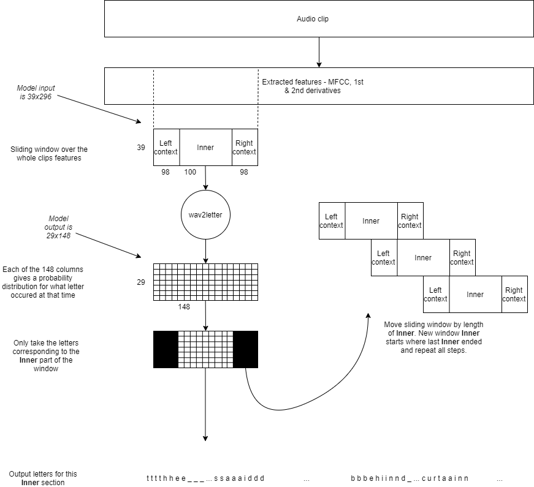

# Automatic Speech Recognition Code Sample

- [Automatic Speech Recognition Code Sample](./asr.md#automatic-speech-recognition-code-sample)
  - [Introduction](./asr.md#introduction)
    - [Preprocessing and feature extraction](./asr.md#preprocessing-and-feature-extraction)
    - [Postprocessing](./asr.md#postprocessing)
    - [Prerequisites](./asr.md#prerequisites)
  - [Building the code sample application from sources](./asr.md#building-the-code-sample-application-from-sources)
    - [Build options](./asr.md#build-options)
    - [Build process](./asr.md#build-process)
    - [Add custom input](./asr.md#add-custom-input)
    - [Add custom model](./asr.md#add-custom-model)
  - [Setting up and running Ethos-U NPU code sample](./asr.md#setting-up-and-running-ethos_u-npu-code-sample)
    - [Setting up the Ethos-U NPU Fast Model](./asr.md#setting-up-the-ethos_u-npu-fast-model)
    - [Starting Fast Model simulation](./asr.md#starting-fast-model-simulation)
    - [Running Automatic Speech Recognition](./asr.md#running-automatic-speech-recognition)

## Introduction

This document describes the process of setting up and running the Arm® *Ethos™-U* NPU Automatic Speech Recognition
example.

Use-case code could be found in the following directory: [source/use_case/asr](../../source/use_case/asr).

### Preprocessing and feature extraction

The *wav2letter* automatic speech recognition model that is used with the code samples, expects audio data to be
preprocessed in a specific way before performing an inference.

This section provides an overview of the feature extraction process used.

First, the audio data is normalized to the range (`-1`, `1`).

> **Note:** Mel-Frequency Cepstral Coefficients (MFCCs) are a common feature that is extracted from audio data and can
> be used as input for machine learning tasks such as keyword spotting and speech recognition. For implementation
> details, please refer to: `source/application/main/include/Mfcc.hpp`

Next, a window of 512 audio samples is taken from the start of the audio clip. From these 512 samples, we calculate 13
MFCC features.

The whole window is shifted to the right by 160 audio samples and 13 new MFCC features are calculated. This process of
shifting and calculating is repeated until enough audio samples to perform an inference have been processed.

In total, this is 296 windows that each have 13 MFCC features calculated for them.

After extracting MFCC features, the first and second order derivatives of these features, regarding time, are
calculated.

These derivative features are then standardized and concatenated with the MFCC features (which also get standardized).
At this point, the input tensor has a shape of 296x39.

These extracted features are quantized and an inference is performed.



For longer audio clips, where multiple inferences must be performed, then the initial starting position is offset by
`(100*160) = 16000` audio samples. From this new starting point, MFCC and derivative features are calculated as before,
until there is enough to perform another inference.

Padding can be used if there are not enough audio samples for at least one inference. This step is repeated until the
whole audio clip has been processed. If there are not enough audio samples for a final complete inference, then the MFCC
features are padded by repeating the last calculated feature until an inference can be performed.

> **Note:** Parameters of the MFCC feature extraction all depend on what was used during model training. These values
> are specific to each model.\
If you switch to a different ASR model than the one supplied, then the feature extraction process could be completely
different to the one currently implemented.

The amount of time that audio samples that are offset for long audio clips is specific to the included *wav2letter*
model.

### Postprocessing

After performing an inference, the raw output must be postprocessed to get a usable result.

The raw output from the model is a tensor of shape 148x29 where each row is a probability distribution over the possible
29 characters that can appear at each of the 148 time steps.

This *wav2letter* model is trained using context windows. This means that, depending on the bit of the audio clip that
is currently being processed, only certain parts of the output are usable.

If this is the first inference, and multiple inferences are required, then ignore the final 49 rows of the output.
Similarly, if this is the final inference from multiple inferences, then ignore the first 49 rows of the output.

Finally, if this inference is not the last, or the first inference, then ignore the first and last 49 rows of the model
output.

> **Note:** If the audio clip is small enough, then the whole of the model output is usable and there is no need to
> throw away any of the outputs before continuing.

Once any rows have been removed, the final processing can be done. To process the output, the letter with the highest
probability at each time step is found first. Next, any letters that are repeated multiple times in a row are removed.

For example: [`t`, `t`, `t`, `o`, `p`, `p`] becomes [`t`, `o`, `p`]). Finally, the 29th blank token letter is removed
from the output.

For the final output, the results from all inferences are combined before decoding. What you are left with is then
displayed to the console.

### Prerequisites

See [Prerequisites](../documentation.md#prerequisites)

## Building the code sample application from sources

### Build options

In addition to the already specified build option in the main documentation, the Automatic Speech Recognition use-case
adds:

- `asr_MODEL_TFLITE_PATH` - The path to the NN model file in `TFLite` format. The model is processed and then included
  into the application `axf` file. The default value points to one of the delivered set of models. Note that the
  parameters `asr_LABELS_TXT_FILE`,`TARGET_PLATFORM`, and `ETHOS_U_NPU_ENABLED` must be aligned with the chosen model. In
  other words:
  - If `ETHOS_U_NPU_ENABLED` is set to `On` or `1`, then the NN model is assumed to be optimized. The model naturally
    falls back to the Arm® *Cortex®-M* CPU if an unoptimized model is supplied.
  - If `ETHOS_U_NPU_ENABLED` is set to `Off` or `0`, then the NN model is assumed to be unoptimized. Supplying an
    optimized model in this case results in a runtime error.

- `asr_FILE_PATH`: The path to the directory containing audio files, or a path to single WAV file, to be used in the
  application. The default value points to the `resources/asr/samples` folder that contains the delivered set of audio
  clips.

- `asr_LABELS_TXT_FILE`: The path to the text file for the label. The file is used to map letter class index to the text
  label. The default value points to the delivered `labels.txt` file inside the delivery package.

- `asr_AUDIO_RATE`: The input data sampling rate. Each audio file from `asr_FILE_PATH` is preprocessed during the build
  to match the NN model input requirements. The default value is `16000`.

- `asr_AUDIO_MONO`: If set to `ON`, then the audio data is converted to mono. The default value is `ON`.

- `asr_AUDIO_OFFSET`: Begins loading audio data and starts from this specified offset, defined in seconds. the default
  value is set to `0`.

- `asr_AUDIO_DURATION`: The length of the audio data to be used in the application in seconds. The default is `0`,
  meaning that the whole audio file is used.

- `asr_AUDIO_MIN_SAMPLES`: Minimum number of samples required by the network model. If the audio clip is shorter than
  this number, then it is padded with zeros. The default value is `16000`.

- `asr_MODEL_SCORE_THRESHOLD`: Threshold value that must be applied to the inference results for a label to be deemed
  valid. The default is `0.5`.

- `asr_ACTIVATION_BUF_SZ`: The intermediate, or activation, buffer size reserved for the NN model. By default, it is set
  to 2MiB and is enough for most models.

To **ONLY** build the automatic speech recognition example application, add `-DUSE_CASE_BUILD=asr` to the `cmake`
command line, as specified in: [Building](../documentation.md#Building).

### Build process

> **Note:** This section describes the process for configuring the build for the *MPS3: SSE-300*. To build for a
> different target platform, please refer to: [Building](../documentation.md#Building).

To build **only** the automatic speech recognition example, create a build directory and navigate inside, like so:

```commandline
mkdir build_asr && cd build_asr
```

On Linux, when providing only the mandatory arguments for CMake configuration, execute the following command to build
**only** Automatic Speech Recognition application to run on the *Ethos-U55* Fast Model:

```commandline
cmake ../ -DUSE_CASE_BUILD=asr
```

To configure a build that can be debugged using Arm DS specify the build type as `Debug` and then use the `Arm Compiler`
toolchain file:

```commandline
cmake .. \
    -DCMAKE_TOOLCHAIN_FILE=scripts/cmake/toolchains/bare-metal-armclang.cmake \
    -DCMAKE_BUILD_TYPE=Debug \
    -DUSE_CASE_BUILD=asr
```

For further information, please refer to:

- [Configuring with custom TPIP dependencies](../sections/building.md#configuring-with-custom-tpip-dependencies)
- [Using Arm Compiler](../sections/building.md#using-arm-compiler)
- [Configuring the build for simple-platform](../sections/building.md#configuring-the-build-for-simple_platform)
- [Building for different Ethos-U NPU variants](../sections/building.md#building-for-different-ethos_u-npu-variants)

> **Note:** If re-building with changed parameters values, we recommend that you clean the build directory and re-run
> the CMake command.

If the CMake command succeeds, build the application as follows:

```commandline
make -j4
```

To see compilation and link details, add `VERBOSE=1`.

Results of the build are placed under the `build/bin` folder, like so:

```tree
bin
 ├── ethos-u-asr.axf
 ├── ethos-u-asr.htm
 ├── ethos-u-asr.map
 └── sectors
      ├── images.txt
      └── asr
          ├── ddr.bin
          └── itcm.bin
```

The `bin` folder contains the following files:

- `ethos-u-asr.axf`: The built application binary for the Automatic Speech Recognition use-case.

- `ethos-u-asr.map`: Information from building the application. For example: The libraries used, what was optimized, and
  the location of objects.

- `ethos-u-asr.htm`: Human readable file containing the call graph of application functions.

- `sectors/asr`: Folder containing the built application. It is split into files for loading into different FPGA memory
  regions.

- `sectors/images.txt`: Tells the FPGA which memory regions to use for loading the binaries in the `sectors/..` folder.

### Add custom input

The application anomaly detection is set up to perform inferences on data found in the folder, or an individual file,
that is pointed to by the parameter `asr_FILE_PATH`.

To run the application with your own audio clips, first create a folder to hold them and then copy the custom clips into
the following folder:

```commandline
mkdir /tmp/custom_wavs

cp my_clip.wav /tmp/custom_wavs/
```

> **Note:** Clean the build directory before re-running the CMake command.

Next, when building, set `asr_FILE_PATH` to the location of the following folder:

```commandline
cmake .. \
    -Dasr_FILE_PATH=/tmp/custom_wavs/ \
    -DUSE_CASE_BUILD=asr
```

The audio flies found in the `asr_FILE_PATH` folder are picked up and automatically converted to C++ files during the
CMake configuration stage. They are then compiled into the application during the build phase for performing inference
with.

The log from the configuration stage tells you what audio directory path has been used:

```log
-- User option asr_FILE_PATH is set to /tmp/custom_wavs
-- Generating audio files from /tmp/custom_wavs
++ Converting my_clip.wav to my_clip.cc
++ Generating build/generated/asr/include/InputFiles.hpp
++ Generating build/generated/asr/src/InputFiles.cc
-- Defined build user options:
-- asr_FILE_PATH=/tmp/custom_wavs
```

After compiling, your custom inputs have now replaced the default ones in the application.

> **Note:** The CMake parameter `asr_AUDIO_MIN_SAMPLES` determines the minimum number of input samples. When building
> the application, if the size of the audio clips is less than `asr_AUDIO_MIN_SAMPLES`, then it is padded until it
> matches.

### Add custom model

The application performs inference using the model pointed to by the CMake parameter `MODEL_TFLITE_PATH`.

> **Note:** If you want to run the model using an *Ethos-U*, ensure that your custom model has been successfully run
> through the Vela compiler *before* continuing.

For further information: [Optimize model with Vela compiler](../sections/building.md#Optimize-custom-model-with-Vela-compiler).

To run the application with a custom model, you must provide a `labels_<model_name>.txt` file of labels that are
associated with the model. Each line of the file must correspond to one of the outputs in your model. Refer to the
provided `labels_wav2letter.txt` file for an example.

Then, you must set `asr_MODEL_TFLITE_PATH` to the location of the Vela processed model file and `asr_LABELS_TXT_FILE`to
the location of the associated labels file.

For example:

```commandline
cmake .. \
    -Dasr_MODEL_TFLITE_PATH=<path/to/custom_model_after_vela.tflite> \
    -Dasr_LABELS_TXT_FILE=<path/to/labels_custom_model.txt> \
    -DUSE_CASE_BUILD=asr
```

> **Note:** Clean the build directory before re-running the CMake command.

The `.tflite` model file pointed to by `asr_MODEL_TFLITE_PATH`, and the labels text file pointed to by
`asr_LABELS_TXT_FILE` are converted to C++ files during the CMake configuration stage. They are then compiled into the
application for performing inference with.

The log from the configuration stage tells you what model path and labels file have been used, for example:

```log
-- User option TARGET_PLATFORM is set to mps3
-- User option asr_MODEL_TFLITE_PATH is set to <path/to/custom_model_after_vela.tflite>
...
-- User option asr_LABELS_TXT_FILE is set to <path/to/labels_custom_model.txt>
...
-- Using <path/to/custom_model_after_vela.tflite>
++ Converting custom_model_after_vela.tflite to\
custom_model_after_vela.tflite.cc
-- Generating labels file from <path/to/labels_custom_model.txt>
-- writing to <path/to/build/generated/src/Labels.cc>
...
```

After compiling, your custom model has now replaced the default one in the application.

## Setting up and running Ethos-U NPU code sample

### Setting up the Ethos-U NPU Fast Model

The FVP is available publicly from
[Arm Ecosystem FVP downloads](https://developer.arm.com/tools-and-software/open-source-software/arm-platforms-software/arm-ecosystem-fvps).

For the *Ethos-U* evaluation, please download the MPS3 based version of the Arm® *Corstone™-300* model that contains *Cortex-M55*
and offers a choice of the *Ethos-U55* and *Ethos-U65* processors.

To install the FVP:

- Unpack the archive.

- Run the install script in the extracted package:

```commandline
./FVP_Corstone_SSE-300.sh
```

- Follow the instructions to install the FVP to the required location.

### Starting Fast Model simulation

Once the building has been completed, the application binary `ethos-u-asr.axf` can be found in the `build/bin` folder.

Assuming that the install location of the FVP was set to `~/FVP_install_location`, then the simulation can be started by
using:

```commandline
~/FVP_install_location/models/Linux64_GCC-6.4/FVP_Corstone_SSE-300_Ethos-U55 ./bin/mps3-sse-300/ethos-u-asr.axf
```

A log output appears on the terminal:

```log
telnetterminal0: Listening for serial connection on port 5000
telnetterminal1: Listening for serial connection on port 5001
telnetterminal2: Listening for serial connection on port 5002
telnetterminal5: Listening for serial connection on port 5003
```

This also launches a telnet window with the standard output of the sample application. It also includes error log
entries containing information about the pre-built application version, TensorFlow Lite Micro library version used, and
data types. The log also includes the input and output tensor sizes of the model compiled into the executable binary.

After the application has started, if `asr_FILE_PATH` points to a single file, or even a folder that contains a single
input file, then the inference starts immediately. If there are multiple inputs, it outputs a menu and then waits for
input from the user.

For example:

```log
User input required
Enter option number from:

1. Classify next audio clip
2. Classify audio clip at chosen index
3. Run classification on all audio clips
4. Show NN model info
5. List audio clips

Choice:

```

What the preceding choices do:

1. Classify next audio clip: Runs a single inference on the next in line.

2. Classify audio clip at chosen index: Runs inference on the chosen audio clip.

    > **Note:** Please make sure to select audio clip index within the range of supplied audio clips during application
    > build. By default, a pre-built application has four files, with indexes from `0` to `3`.

3. Run ... on all: Triggers sequential inference executions on all built-in applications.

4. Show NN model info: Prints information about the model data type, input, and output, tensor sizes:

    ```log
    INFO - Model info:
    INFO - Model INPUT tensors:
    INFO -  tensor type is INT8
    INFO -  tensor occupies 11544 bytes with dimensions
    INFO -    0:   1
    INFO -    1: 296
    INFO -    2:  39
    INFO - Quant dimension: 0
    INFO - Scale[0] = 0.110316
    INFO - ZeroPoint[0] = -11
    INFO - Model OUTPUT tensors:
    INFO -  tensor type is INT8
    INFO -  tensor occupies 4292 bytes with dimensions
    INFO -    0:   1
    INFO -    1:   1
    INFO -    2: 148
    INFO -    3:  29
    INFO - Quant dimension: 0
    INFO - Scale[0] = 0.003906
    INFO - ZeroPoint[0] = -128
    INFO - Activation buffer (a.k.a tensor arena) size used: 783168
    INFO - Number of operators: 1
    INFO -  Operator 0: ethos-u
    ```

5. List audio clips: Prints a list of pair ... indexes. The original filenames are embedded in the application, like so:

    ```log
    [INFO] List of Files:
    [INFO] 0 => another_door.wav
    [INFO] 1 => another_engineer.wav
    [INFO] 2 => i_tell_you.wav
    [INFO] 3 => testing_routine.wav
    ```

### Running Automatic Speech Recognition

Please select the first menu option to execute Automatic Speech Recognition.

The following example illustrates the output of an application:

```log
INFO - Running inference on audio clip 0 => another_door.wav
INFO - Inference 1/2
INFO - Inference 2/2
INFO - Final results:
INFO - Total number of inferences: 2
INFO - For timestamp: 0.000000 (inference #: 0); label: and he walked immediately out of th
INFO - For timestamp: 0.000000 (inference #: 1); label: e apartment by another door
INFO - Complete recognition: and he walked immediately out of the apartment by another door
INFO - Profile for Inference :
INFO - NPU AXI0_RD_DATA_BEAT_RECEIVED beats: 6564262
INFO - NPU AXI0_WR_DATA_BEAT_WRITTEN beats: 928889
INFO - NPU AXI1_RD_DATA_BEAT_RECEIVED beats: 841712
INFO - NPU ACTIVE cycles: 28450696
INFO - NPU IDLE cycles: 476
INFO - NPU TOTAL cycles: 28451172
```

It can take several minutes to complete each inference. The average time is around 5-7 minutes, and on this audio clip,
multiple inferences were required to cover the whole clip.

The profiling section of the log shows that for the first inference:

- *Ethos-U* PMU report:

  - 28,451,172 total cycle: The number of NPU cycles.

  - 28,450,696 active cycles: The number of NPU cycles that were used for computation.

  - 476 idle cycles: The number of cycles for which the NPU was idle.

  - 6,564,262 AXI0 read beats: The number of AXI beats with read transactions from the AXI0 bus. AXI0 is the bus where
    - the *Ethos-U* NPU reads and writes to the computation buffers, activation buf, or tensor arenas.

  - 928,889 AXI0 write beats: The number of AXI beats with write transactions to the AXI0 bus.

  - 841,712 AXI1 read beats: The number of AXI beats with read transactions from the AXI1 bus. AXI1 is the bus where the
    *Ethos-U55* NPU reads the model. So, read-only.

- For FPGA platforms, a CPU cycle count can also be enabled. However, do not use cycle counters for FVP, as the CPU
  model is not cycle-approximate or cycle-accurate.

The application prints the decoded output from each of the inference runs, and the final combined result.
